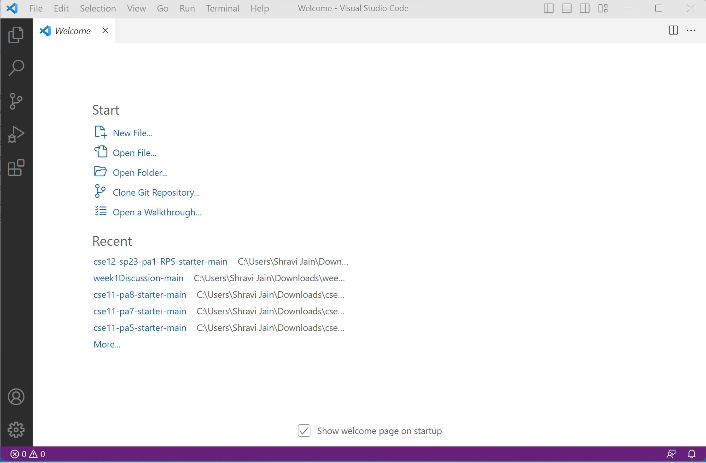
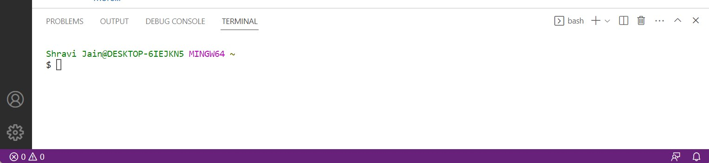
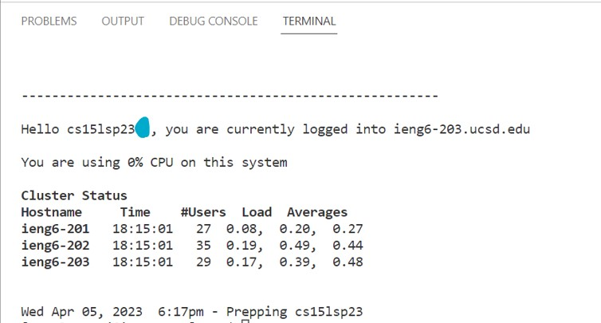
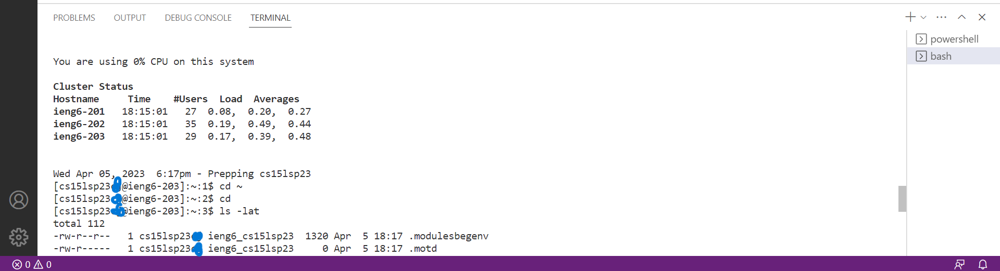
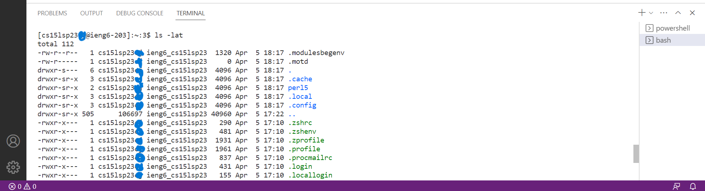
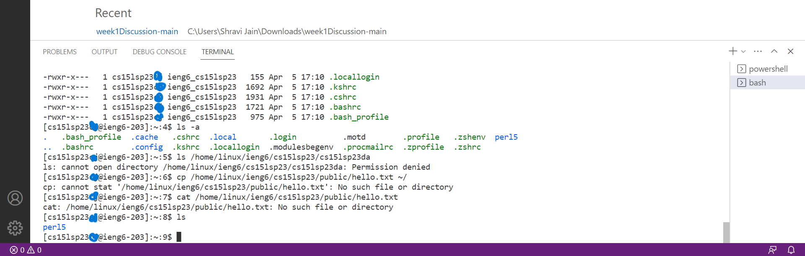

# Lab Report 1 - Remote Access and FileSystem

* ## Installing VScode
1. I had already installed VS code on my device during CSE8B last quarter. I went to the Visual Studio Code website [Link](https://code.visualstudio.com/) 
2. On the website, I clicked on the **Download** option on the top of the page. From there, you will have different options to install VScode depending on your operating system. I used the option for Windows operating system.
3. After the .exe file is downloaded, we need to execute it which opens the Installation Wizard for VScode. I generally clicked 'Next' for all the steps and finished the setup.
4. Now you can open the VScode application. It should look similar to the following image.

---
* ## Remotely Connecting
1. If you are a Windows user, you would have to install Git using [Git for Windows](https://gitforwindows.org/)
2. After clicking the download option, a .exe file will start downloading which when opened will setup Git on your system. 
3. The Git software will be used for opening the bash terminal in VScode. I followed the steps given on this website [Using Git on Windows](https://stackoverflow.com/a/50527994)
4. Your bash terminal should look similar to this: 
5. Then use the command `ssh cs15lsp23xx@ieng6.ucsd.edu` The xx represents the two unique characters at the end of student specific CSE15L account. You can find this student specific account by going to [CSE15L Specific account](https://sdacs.ucsd.edu/~icc/index.php). On the given link, you would look up your account and under **Additional Accounts** you will see your course specific account. When you click on it, it would take you to the Password Change Tool where you can set up the passowrd which you would have to input in the bash terminal while connecting to the remote server.
6. After the command is executed, the terminal asks that whether we are sure we want to connect. I answered yes so that the connection could proceed
7. Next, you have to enter your password. The password would not be displayed while typing even in the form of asterisk/dot so it may seem that you are not typing anything but in reality it is collecting the input. If you had changed your account password quite recently, there is a chance that it has not been updated yet. I had to wait around 20 minutes for my password to be accepted by the terminal in order to proceed.
8. After the connection is finally established, the output should be something like this: 

---
* ## Running different commands

Here are some of the commands along with their outputs I ran on my system while being remotely connected to the server.

1. `cd` - change directory - Since it is passed with no argument, it changes the directory to home directory which is where I am already at. Similary `cd ~` also goes to the home directory.
2. `ls -lat` displays all the files based on which were modified most recently
3. `ls -a` displays the names of the files which have **.** in their extension
4. `cp /home/linux/ieng6/cs15lsp23/public/hello.txt ~/` represents we are trying to copy a file to a new source but since the file doesn't exist at present it shows that no direcrory/file found.
5. Similarly, for `cat /home/linux/ieng6/cs15lsp23/public/hello.txt`as well, since no file by hello.txt exists, the terminal displays that file is not found.

PS: At first, I didn't understand the why the commands `ls - lat` and `ls -a` displayed the outputs they did, but after asking the tutor present and searching about them on Google, I understood the outputs produced by them.
