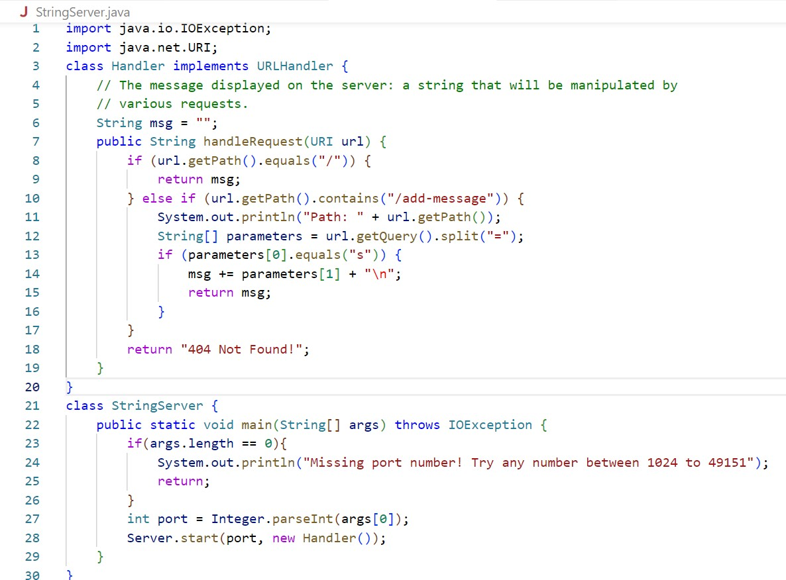
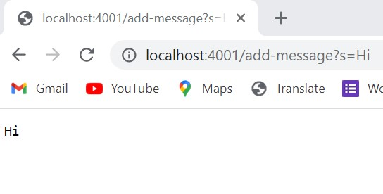
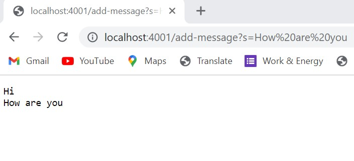
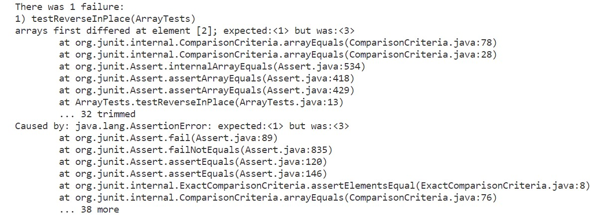

# Lab Report 2 - Servers and Bugs

* ## Part 1 - StringServer

    * **Code**



    * **Output 1**



    * **Output 2**



---
1. In both the cases, the main method inside StringServer class is called which starts a server with the port number provided in the command line input by the user. 
2. After ther server is started, we can click on the link provided in the command line which would be something similar to `http://localhost:port`
3. After going to the server, we can edit its path and add `/add-message?string we want to display` to the path. This would call the handleRequest function in the code which will update the message to be displayed on the server's page.
4. In the first output, it is the first time editing the path so it just displays the message value which I provided as input for 's ='. Hence, the `msg` variable in code is relevant. If I had not typed anything after the path, the 'msg' variable would remain unchanged and the website would display nothing. However, since I include 'add=message' command, it gets edited path by using the 'getPath' method and then calls 'getQuery' method along with split() to access the value I provided. At last, it concatenates the provided value to 'msg' variable along with a new line character(\n) and returns it which gets displayed on the page. 
5. Similarly, for the second output as well. The 'msg' variable holds relevance. It calls the same methods - getPath, get Query, split - to get the other value I provided. But this time, it adds to the existing value of 'msg' which had been changed in the first output. It concatenates the provided value to that which leads to the display of both 'Hi' and 'How are you'. 

---

* ## Part 2 - Debugging
I have chosen the **reverseIn Place** method from ArrayExamples.
1. Failure-induicing input
```
int[] input2 = {1, 2, 3};
ArrayExamples.reverseInPlace(input2);
assertArrayEquals(new int[] {3,2,1}, input2);
```
2. Non-Failure inducing input
```
int[] input1 = {3, 3, 3};
ArrayExamples.reverseInPlace(input1);
assertArrayEquals(new int[]{3, 3, 3}, input1);
```
3. Output of the tests

4. Code before fixing
```
static void reverseInPlace(int[] arr) {
    for(int i = 0; i < arr.length; i += 1) {
      arr[i] = arr[arr.length - i - 1];
    }
  }
```
5. Code after fixing
```
static void reverseInPlace(int[] arr) {
    for(int i = 0; i < arr.length/2; i += 1) {
      int temp = arr[i];
      arr[i] = arr[arr.length - i - 1];
      arr[arr.length - i - 1] = temp;
    }
 }
```

    * The code before being fixed, it was swapping the elements starting from the first index till the last one for the whole length if the array due to which it was basically reversing the swap it did in the first half. Hence, it shows a failure for an array with different elements but for an array with same elements, it does not since the reverse of an array with identical elements would be same as well.
    * The above code fixes the issue becuase it only goes through with the swapping for the first half of the list which produces the desired result.

---

* ## Part 3 - Reflection
There were a lot of things I learned in weeks 2 and 3. Some of them are:
    * Using the Server.java, to create our own servers and playing with the paths and getting a glmipse of how the webpages would work in real world. 
    * I had not used Github before this course, so learning more about Git and Github Desktop is interesting and new.
    * I also learned about the different terms we use to refer to different parts of the URL.
    * Moreover, I gained more knowledge about debugging, understanding the failures and how to test my code more extensively.
    * Lastly, realizing the importance of tab key and noticing how much time it saves me was pretty useful.
