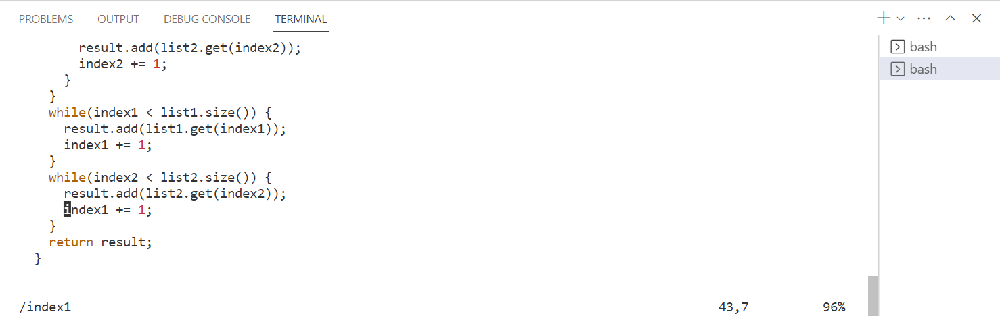
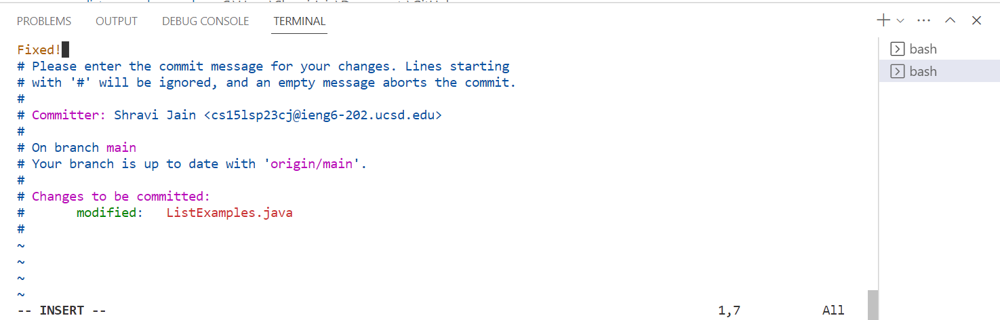

# Lab Report 4 - Command Line

## Baseline:
* Time taken to do all the tasks - 6 minutes approximately
1. Log into ieng6 - I entered the whole command of ssh without copying/pasting it from anywhere: `ssh cs15lsp23cj<shift>2ieng6.ucsd.edu` and then pressed <enter>. 
Since I had created a ssh key for it, I didn't have to type in my password. It directly logged in. Moreover, I had to use <shift>2 for `@` character.
  
  
  
2. Clone your fork of the repository from your Github account - I copied (Ctrl-C) the link of the fork and pasted (Ctrl-V) into the command line after typing `git clone` and then pressed <enter>.
  
  
  
3. Run the tests, demonstrating that they fail - I typed `cd<space>l<tab><enter>`. Pressing <tab> after l, autocompleted the path for me to change the directory to lab7. Then I pressed Ctrl-C to copy the `javac -cp .:lib/hamcrest-core-1.3.jar:lib/junit-4.13.2.jar *.java` command from previous weeks and Ctrl-V, pasted it into the command line. Then I pressed <enter>. I did the same copy and paste for the `java -cp .:lib/hamcrest-core-1.3.jar:lib/junit-4.13.2.jar org.junit.runner.JUnitCore ListExamplesTests` command as well but changed the file's name to `ListExamplesTests` for which I pressed - `L<tab>T<tab><enter>` to autocomplete it for me. I had to do <tab> twice since there was a file named ListExamples.java as well in the folder.
  
  
  
4. Edit the code file to fix the failing test - I pressed `vim<space>Li<tab>.j<tab><enter>` where <tab> helps me in autocompleting the file's name. Then the vim window opens where I scroll to the bottom and type `\index1<enter>` which brings the cursor to the index1 in the merge function. Then I press, `lllllxi2<esc><esc>:wq`. This would wove the cursor 5 times to the right, delete the character where the cursor is, insert 2 in its position, escape to normal mode and save and exit the vim window.
  
  
  
  
  
5. Run the tests, demonstrating that they now succeed - I used <up><up><up><enter> since the `javac` command to compile the files was 3 up in the terminal history, so I used up arrow for it. Similarly, I used <up><up><up><enter> to run the `java` command on the tests file since it was 3 up as well.
  
  
  
6. Commit and push the resulting change to your Github account - I pressed `git<space>add<space>L<tab>.j<tab><enter>` where I used tab to autocomplete file's name. Then, `git<space>commit<enter>` which opened the vim similar window for commit and added the message "Fixed!" by pressing `iFixed!<esc>:wq` where 'i' put it in insert mode where I typed the message and ':wq' for save and exit. Similarly, I added the new class files created by pressing `git<space>add<space>L<tab>.c<tab><space>L<tab>T<tab><space>S<tab><enter>` and then `git<space>commit<enter>` where I inserted "Add" as the message to be displayed by pressing `iAdd<esc>:wq`. Finally I pressed `git<space>push<enter>` to push the changes into my repository.
  
  
  
  
  
  
  
  

  
