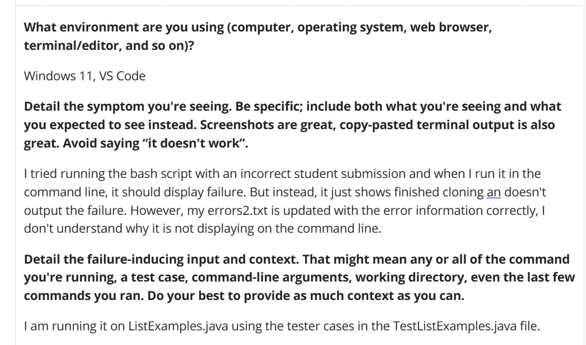
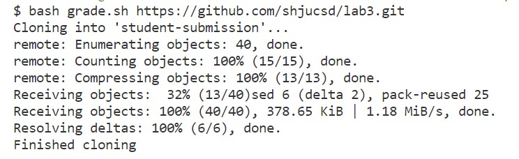
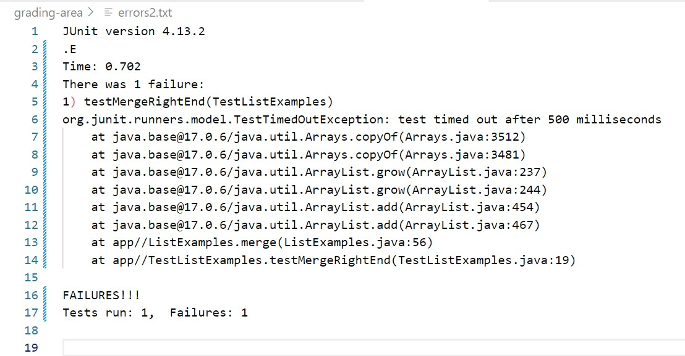
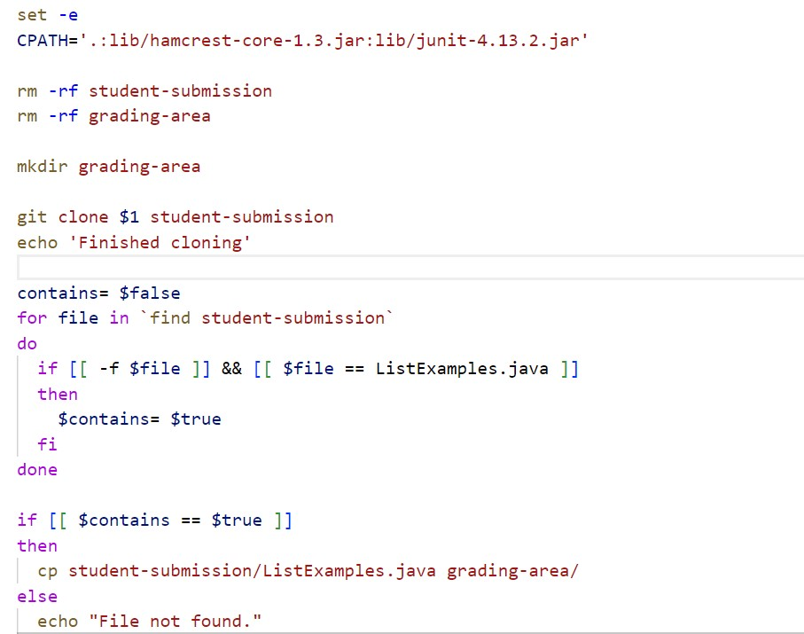
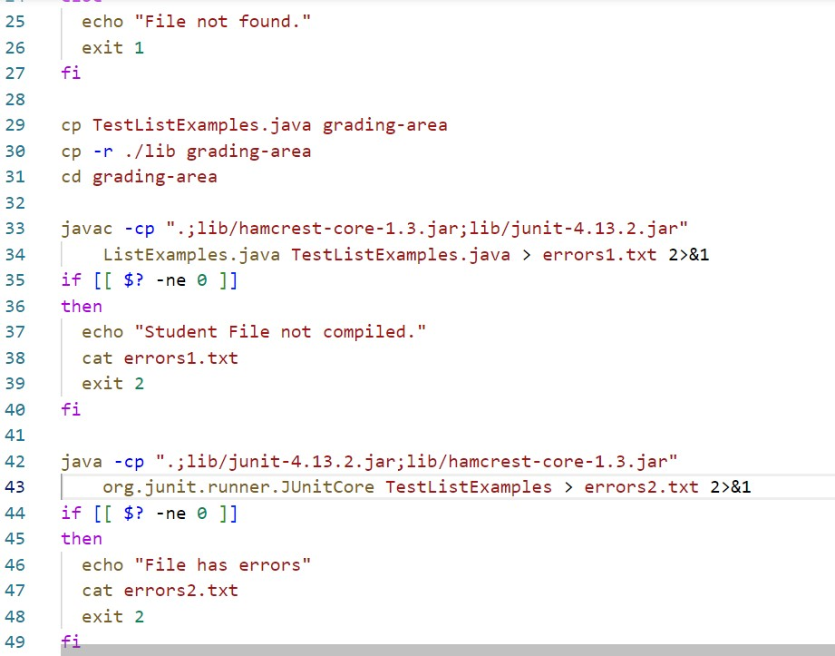
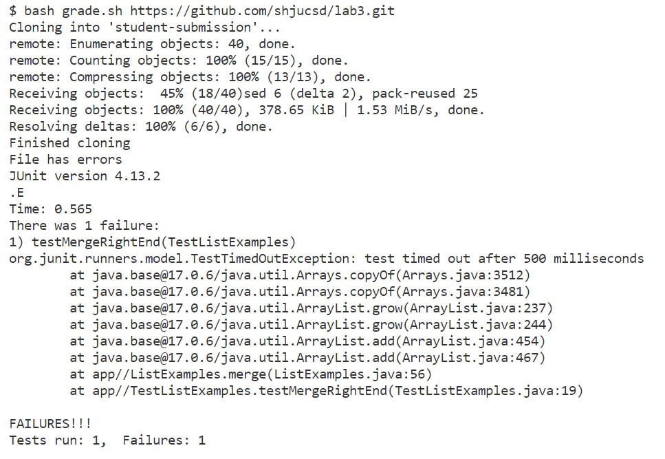
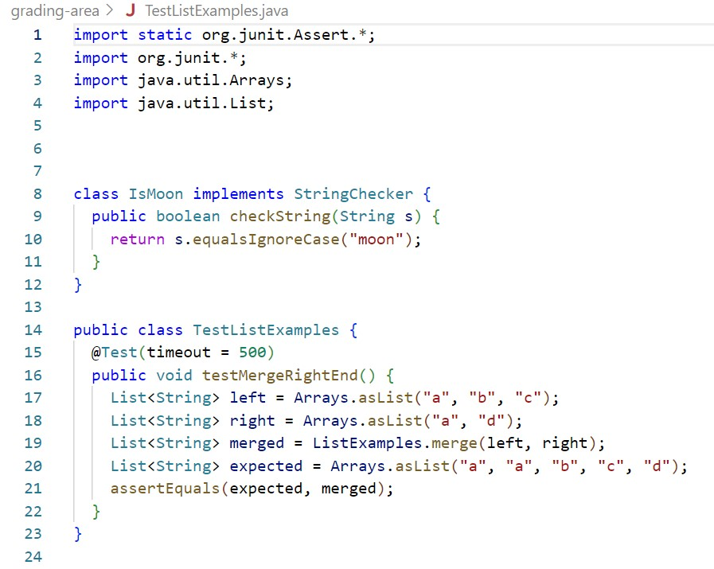
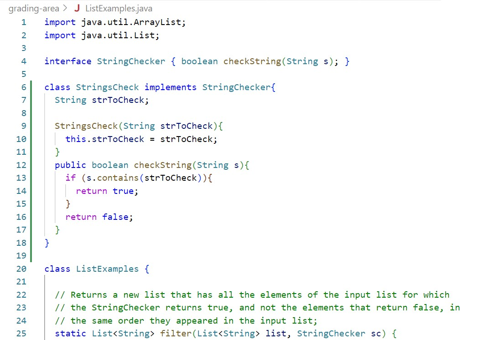
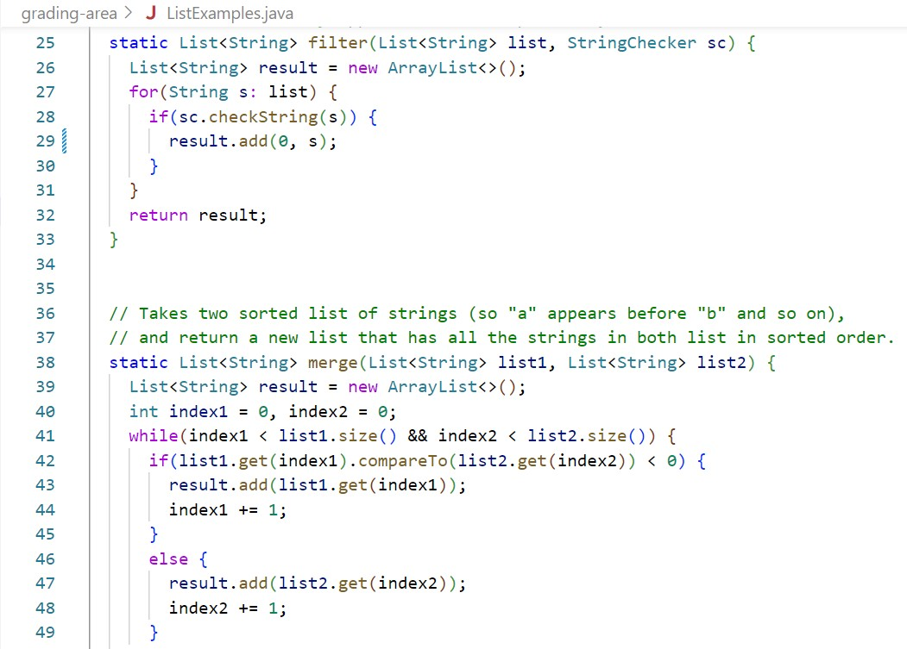
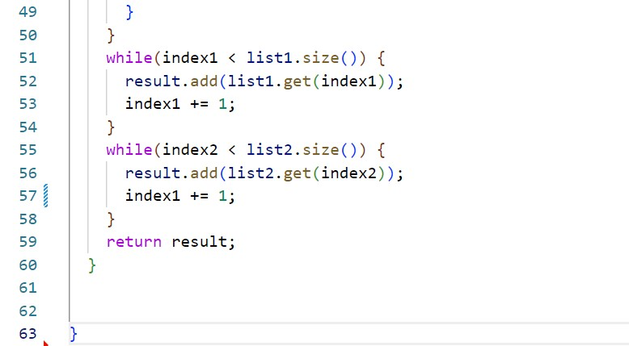

# Lab Report 5 - Putting It All Together

## Part 1
---
* **EdStem Post Template** describing the problem along with relevant outputs and files' screenshots:

* **TA response** : Hi! I would consider including a `set +e` command in your bash script since set -e stops running the bash script as soon as there is an error. That's why your error output is not being displayed on the command line because the program stops before encountering it. The `set +e` turns off this setting and continues to run the script even with errors. Hope it helps!

* **Output** after using the `set +e` command in code:

**Description of the bug** - The bug was that due to `set -e` command at the top of the grade.sh file. It was preventing the text from error2.txt in the file beiing printed in the terminal. Since the `java` command induces a failure, the script never executes the `cat errors2.txt` command in the if statement leading to it not printing out. However, after adding `set +e` it turns off the `set -e` setting and continues with the script and thus prints the failure which was caused by the incorrect implementation of ListExamples.java

* **Setup information**:

1. **File and directory structure needed** - The directory is list-examples-grader which contains the bash script - grade.sh and TestListExamples.java. The argument provided in the command line along with the `bash grade.sh` command is the GitHub repository for student's submission which contains the ListExamples.java. Then these three files are copied into a new directory - grading-area for running the tests on ListExamples.java. 
2. **Contents of each file before fixing the bug**:
* grade.sh:

* TestListExamples.java

* ListExamples.java

3. **The command I ran to trigger the bug** - `bash grade.sh https://github.com/shjucsd/lab3.git`
4. **Description to fix the bug** - I added a `set +e` command after the `cd grading-area` command in the grade.sh file. This command would keep the bash script running even after an error is produced. This means that even though the `java` command when run on TestListExamples.java produces an error, the program still goes to next line of the `if` clause and execute the `cat error2.txt` command which results in the desired output in the terminal.

---

## Part 2 - Reflection
In the second half of the quarter, I learned about bash scripts and vim command in the terminal. I didn't know that so many things were possible just in the command line interface. Moreover, the redirection symbols in bash script helped in looking at the errors/outputs in a simpler way. Also, the building of the grade.sh bash script thought a bit tough at first, but whe it finally executed was pretty cool.

